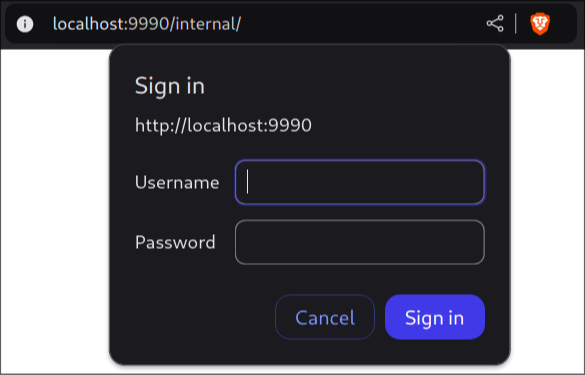

## Telematic Applications

# HTTP Lab

*Academic year 2024-2025*

---

## Introduction

### Symlinks and scripts

A symlink to the `apache2` executable was created in `~/.local/bin` for
convenience.

### Privacy and variables

For privacy, some measurements were taken to hide some private data using
environment variables and placeholders.

The environment variables used were

* `HTTPD_ROOT`, set to the absolute path to the `httpd` folder in this repo
* `LISTEN_PORT`, set to `9xxx`, where `xxx` are the last 3 digits of my `UID`
* `HOSTNAME`, set to the value of the environment variable `HOSTNAME`

Run the `env_set.sh` script from the repo root to set these variables. Remember
to run it with `. env_set.sh` so it can properly set environment variables.

## Part 1: Server Configuration

### 1.1. Directory setup

This was easily done following the instructions, moving the necessary files and
creating the subdirectories in the `httpd` directory in this repository.

```text
httpd/
├── apache2.conf
├── mime.types
├── defaultdocs/
├── log/
├── vhost1/
│   ├── docs/
│   └── log/
└── vhost2/
    ├── docs/
    └── log/
```

### 1.2. Config file setup

The `apache2.conf` was modified as instructed, using environment variable
placeholders according to spec where it seemed appropriate:

* The `ServerRoot` option was set to the value of the aforementioned
  `HTTPD_ROOT` environment variable:

    ```apacheconf
    ServerRoot ${HTTPD_ROOT}
    ```

* The `ServerName` option was set to a value depending on the running machine:

    ```apacheconf
    ServerName ${HOSTNAME}.lab.it.uc3m.es
    ```

* The `Listen` option was set to the value of the aforementioned
  `LISTEN_PORT` environment variable:

    ```apacheconf
    Listen ${LISTEN_PORT}
    ```

### 1.3. Create a simple html webpage

The file was created with the following contents (in English and indented):

```html
<html>
    <body>
        Hello World!
    </body>
</html>
```

### 1.4. Start the server

As mentioned in the introduction, the server executable was symlinked to the
`.local/bin` folder, which is in the path, for convenience. The server was run,
from the repo root, using the following command, which also makes use of
environment variables:

```sh
apache2 -f "$PWD/httpd/apache2.conf"
```

The server was started with no issues.

### 1.5. Access the webpage

This gave me a huge headache. Since I always work remotely, using my laptop and
remote terminals, I tried accessing the webpage at the following URL:

```
http://<HOSTNAME>:<LISTEN_PORT>/aptel.html
```

Where `<HOSTNAME>` and `<LISTEN_PORT>` were the hostname of the machine where
the server was started and the port as set before. However, my local browser
completely failed to retrieve the page requested.

After about an hour of tweaking the configuration, trying to use absolute IP
addresses and paths instead of names and environment variables, I tried to
`curl` the webpage from the same machine that was running the server, and I
finally got my expected response. As it turns out, the server I started would
not respond to requests from my machine, probably due to firewall rules.
Accessing the server through a web browser on the lab machines also worked.

Upon `curl` of the webpage created
(`http://<HOSTNAME>:<LISTEN_PORT>/aptel.html`), we got the contents of the html
file we created before.

```html
<html>
    <body>
        Hello World!
    </body>
</html>
```

Upon `curl` of the root (`http://<HOSTNAME>:<LISTEN_PORT>/`), we got a 404
error along with an html file describing the issue:

```html
<!DOCTYPE HTML PUBLIC "-//IETF//DTD HTML 2.0//EN">
<html><head>
<title>404 Not Found</title>
</head><body>
<h1>Not Found</h1>
<p>The requested URL was not found on this server.</p>
</body></html>
```

## Part 2: HTTP Requests and Responses

In this section, commands were first written in batch in `.http` files in the
`cmds` folder, and then piped into the server using `netcat` (or `nc`). The
same sequence of commands can be sent manually using `telnet`, as instructed in
the lab guide.

> **Note**
>
> Note that these command files must have `CRLF` (DOS-style) line endings.
> Otherwise, the server will not understand the commands and it will respond
> with `400 Bad Request`

### 2.6. Requests through the command line

Requests were first made with HTTP/0.9 and then with HTTP/1.0 to get the
`/aptel.html` and `/` (root) resources.

#### 2.6.1 Requests with HTTP/0.9

First, both requests were made with HTTP/0.9, with the following commands and
responses

```http
GET /aptel.html
```

```html
<html>
    <body>
        Hello World!
    </body>
</html>
```

```http
GET /
```

```html
<!DOCTYPE HTML PUBLIC "-//IETF//DTD HTML 2.0//EN">
<html><head>
<title>404 Not Found</title>
</head><body>
<h1>Not Found</h1>
<p>The requested URL was not found on this server.</p>
</body></html>
```

As we can see, the responses we get are in pure html format, **with no
headers**. Furthermore, the connections were closed immediately after the
transaction, as it's done in HTTP/0.9.

#### 2.6.2. Requests with HTTP/1.0

Both resources were requested again, this time using HTTP/1.0 with the
following commands and responses:

```http
GET /aptel.html HTTP/1.0
​
```

Note the empty line at the end. It is required to send an empty line to signal
the end of the headers section, which are supported in HTTP/1.0.

```http
HTTP/1.1 200 OK
Date: Thu, 12 Dec 2024 17:53:49 GMT
Server: Apache/2.4.57 (Debian)
Last-Modified: Tue, 10 Dec 2024 12:26:47 GMT
ETag: "3b-628e99848b804"
Accept-Ranges: bytes
Content-Length: 59
Connection: close
Content-Type: text/html

<html>
    <body>
        Hello World!
    </body>
</html>
```

As we can see, this time the server responded with a few headers:

* `Date`
* `Server`
* `Last-Modified`
* `ETag`
* `Accept-Ranges`
* `Content-Length`
* `Content-Type`
* `Connection`

After an **empty line**, which signals the end of the header section, the same
html file from before was included.

The root resource was also requested using HTML/1.0

```http
GET / HTTP/1.0
​
```

Note again the empty line at the end.

The response was similar to the one obtained with HTTP/0.9, but including
headers.

```http
HTTP/1.1 404 Not Found
Date: Thu, 12 Dec 2024 17:54:02 GMT
Server: Apache/2.4.57 (Debian)
Content-Length: 196
Connection: close
Content-Type: text/html; charset=iso-8859-1

<!DOCTYPE HTML PUBLIC "-//IETF//DTD HTML 2.0//EN">
<html><head>
<title>404 Not Found</title>
</head><body>
<h1>Not Found</h1>
<p>The requested URL was not found on this server.</p>
</body></html>
```

In this case we got a few headers less, only including the following list:

* `Date`
* `Server`
* `Content-Length`
* `Content-Type`
* `Connection`

### 2.7. Requests with HTTP/1.1

In HTTP/1.1, the `Host` header is mandatory. The request for the `/aptel.html`
resource is as follows:

```http
GET /aptel.html HTTP/1.1
Host: localhost
​
```

The response was almost identical to the one obtained with HTTP/1.0, except for
the `Date` header contente and the **exclusion of the `Connection: close`
header**. The server **did not close the connection** because, by default,
HTTP/1.1 connections are persistent.

In order to request that the connection be closed immediately, we can include
the `Connection: close` header in the request:

```http
GET /aptel.html HTTP/1.1
Host: localhost
Connection: close
​
```

When this request is sent, the server added the `Connection: close` header to
their response, and then closed the connection immediately after sending the
response, just like in section 2.6.2

### 2.8. Measure keep-alive timeout

Indeed, the server does close the connection after a certain amount of time if
no further requests are sent. This timeout was measured using the `time`
command on the same request used for section 2.7.1. The full command input and
output can be checked in the logs.

```text
real 15.01
user 0.00
sys 0.00
```

Neglecting the time it took for the request and response exchange, we can see
that the server closed the connection after approximately 15 seconds of
inactivity. This is consistent with the value in the `apache2.conf` file:

```apacheconf
#
# KeepAliveTimeout: Number of seconds to wait for the next request from the
# same client on the same connection.
#
KeepAliveTimeout 15
```

### 2.9. Explain `KeepAlive` and `MaxKeepAliveRequests`

As explained in the config file, the `KeepAlive` is a sort of master switch to
enable or disable persistent connections. It should be kept to `On` for
HTTP/1.1, but can be disabled if the server admin wants to.

```apacheconf
#
# KeepAlive: Whether or not to allow persistent connections (more than
# one request per connection). Set to "Off" to deactivate.
#
KeepAlive On
```

As also explained in the config file, the `MaxKeepAliveRequests` is a limit for
the number of requests a single connection will handle. If the server receives
this amount of requests in a single connection, it will close the connection,
forcing the client to make a new one if it wants to keep making requests.

```apacheconf
#
# MaxKeepAliveRequests: The maximum number of requests to allow
# during a persistent connection. Set to 0 to allow an unlimited amount.
# We recommend you leave this number high, for maximum performance.
#
MaxKeepAliveRequests 100
```

## Part 3: Processes and Resources in the Web Server

### 3.10. Process count

#### 3.10.1. Default process count

By running `ps x | grep apache2` we can manually count how many server
processes are running:

```text
  75240 ?        Ss     0:00 apache2 -f /usr/lab/alum/0493990/Projects/4.TApp/4.Labs/http/httpd/apache2.conf
  75248 ?        S      0:00 apache2 -f /usr/lab/alum/0493990/Projects/4.TApp/4.Labs/http/httpd/apache2.conf
  75249 ?        S      0:00 apache2 -f /usr/lab/alum/0493990/Projects/4.TApp/4.Labs/http/httpd/apache2.conf
  75250 ?        S      0:00 apache2 -f /usr/lab/alum/0493990/Projects/4.TApp/4.Labs/http/httpd/apache2.conf
  75251 ?        S      0:00 apache2 -f /usr/lab/alum/0493990/Projects/4.TApp/4.Labs/http/httpd/apache2.conf
  75252 ?        S      0:00 apache2 -f /usr/lab/alum/0493990/Projects/4.TApp/4.Labs/http/httpd/apache2.conf
  97631 ?        S      0:00 apache2 -f /usr/lab/alum/0493990/Projects/4.TApp/4.Labs/http/httpd/apache2.conf
```

We can manually count that there were 7 server processes in total at the time
of running the command.

> **Note**
>
> We can also get this number by filtering the process list and redirecting it
> to `wc -l`, or watch as it changes using `watch`. See the following list of
> useful commands:
>
> * `ps x | grep apache | grep -v grep | wc -l`
> * `watch -n 1 'ps x | grep apache | grep -v grep'`
> * `watch -n 1 'ps x | grep apache | grep -v grep | tee /dev/stderr | wc -l'`

We can check the pertinent directives in the server config:

```apacheconf
    StartServers          5
    MinSpareServers       5
    MaxSpareServers      10
    MaxClients          150
    MaxRequestsPerChild   100
```

The number of child processes indicated in the `StartServers` directive is
**5**, which seems inconsistent with this result. However, once you take into
account the `MinSpareServers` and the fact that this is measured after a
request was made to this server, it makes sense.

If you restart the server, you'll get **6** running processes: the **parent and
5 children**. Once you open a connection, one child becomes busy, and in order
to keep 5 *spare* children (not busy), an extra child is spawned, resulting in
**7 idle children at the end**. If 6 connections were started simultaneously,
a total of 11 children would be observed in the process list, but once the
connections were closed, one of them would be killed in order to honor the
`MaxSpareServers` directive, which is set to 10.

#### 3.10.2. Increasing default process count

The `StartServers` directive was changed to **8**, as instructed, leaving the
rest of the setting unchanged:

```apacheconf
    StartServers          8
    MinSpareServers       5
    MaxSpareServers      10
    MaxClients          150
    MaxRequestsPerChild   100
```

In order to apply this config, the server must be stopped and started again.
The following are some methods for stopping the server:

* `pkill apache2`
* `apache2 -f "$PWD/httpd/apache2.conf" -k stop`

Once started, we can see that the process list now has 9 server processes:

```text
 153425 ?        Ss     0:00 apache2 -f /usr/lab/alum/0493990/Projects/4.TApp/4.Labs/http/httpd/apache2.conf
 153431 ?        S      0:00 apache2 -f /usr/lab/alum/0493990/Projects/4.TApp/4.Labs/http/httpd/apache2.conf
 153434 ?        S      0:00 apache2 -f /usr/lab/alum/0493990/Projects/4.TApp/4.Labs/http/httpd/apache2.conf
 153435 ?        S      0:00 apache2 -f /usr/lab/alum/0493990/Projects/4.TApp/4.Labs/http/httpd/apache2.conf
 153436 ?        S      0:00 apache2 -f /usr/lab/alum/0493990/Projects/4.TApp/4.Labs/http/httpd/apache2.conf
 153437 ?        S      0:00 apache2 -f /usr/lab/alum/0493990/Projects/4.TApp/4.Labs/http/httpd/apache2.conf
 153438 ?        S      0:00 apache2 -f /usr/lab/alum/0493990/Projects/4.TApp/4.Labs/http/httpd/apache2.conf
 153439 ?        S      0:00 apache2 -f /usr/lab/alum/0493990/Projects/4.TApp/4.Labs/http/httpd/apache2.conf
 153440 ?        S      0:00 apache2 -f /usr/lab/alum/0493990/Projects/4.TApp/4.Labs/http/httpd/apache2.conf
```

In this case, if we connect to the server, no new processes have to be started,
as only one of 8 child processes would be busy, leaving 7 *spare* children.

## Part 4: Logs Management

> **Note**
>
> Until now, the contents of the logs folder were excluded from this
> repository, as specified in the `.gitignore` file. During this section, they
> will be explicitly added.

### 4.11. Error log

Upon inspection of the [error log](httpd/log/error.log), the messages appeared
to only be about starting and stopping the server. The following are the log
messages generated during a normal operating cycle (from start to stop)

```text
[Tue Dec 17 16:42:53.888162 2024] [mpm_prefork:notice] [pid 134361] AH00163: Apache/2.4.57 (Debian) configured -- resuming normal operations
[Tue Dec 17 16:42:53.888240 2024] [core:notice] [pid 134361] AH00094: Command line: 'apache2 -f /usr/lab/alum/0493990/Projects/4.TApp/4.Labs/http/httpd/apache2.conf'
[Tue Dec 17 17:06:32.348118 2024] [mpm_prefork:notice] [pid 134361] AH00169: caught SIGTERM, shutting down
```

As instructed, `LogLevel` was increased to `detail`. For easier comparison, the
new logs were saved to a different file, now called
[`error_debug.log`](httpd/log/error_debug.log), and the server was restarted.
This file contained much more detail about the server operation. The following
is an extract equivalent to the one shown previously, from server start to
stopping, including one GET request (the same one as in section 2.7.1).

```text
[Tue Dec 17 17:42:58.534618 2024] [watchdog:debug] [pid 164072] mod_watchdog.c(445): AH010033: Watchdog: Running with WatchdogInterval 1000ms
[Tue Dec 17 17:42:58.534687 2024] [watchdog:debug] [pid 164072] mod_watchdog.c(454): AH02974: Watchdog: found parent providers.
[Tue Dec 17 17:42:58.534691 2024] [watchdog:debug] [pid 164072] mod_watchdog.c(500): AH02977: Watchdog: found child providers.
[Tue Dec 17 17:42:58.534694 2024] [watchdog:debug] [pid 164072] mod_watchdog.c(508): AH02978: Watchdog: Looking for child (_singleton_).
[Tue Dec 17 17:42:58.534696 2024] [watchdog:debug] [pid 164072] mod_watchdog.c(508): AH02978: Watchdog: Looking for child (_default_).
[Tue Dec 17 17:42:58.537915 2024] [watchdog:debug] [pid 164080] mod_watchdog.c(559): AH02980: Watchdog: nothing configured?
[Tue Dec 17 17:42:58.538155 2024] [watchdog:debug] [pid 164081] mod_watchdog.c(559): AH02980: Watchdog: nothing configured?
[Tue Dec 17 17:42:58.538355 2024] [watchdog:debug] [pid 164082] mod_watchdog.c(559): AH02980: Watchdog: nothing configured?
[Tue Dec 17 17:42:58.538583 2024] [watchdog:debug] [pid 164083] mod_watchdog.c(559): AH02980: Watchdog: nothing configured?
[Tue Dec 17 17:42:58.538735 2024] [watchdog:debug] [pid 164084] mod_watchdog.c(559): AH02980: Watchdog: nothing configured?
[Tue Dec 17 17:42:58.539119 2024] [watchdog:debug] [pid 164085] mod_watchdog.c(559): AH02980: Watchdog: nothing configured?
[Tue Dec 17 17:42:58.539204 2024] [watchdog:debug] [pid 164086] mod_watchdog.c(559): AH02980: Watchdog: nothing configured?
[Tue Dec 17 17:42:58.539312 2024] [mpm_prefork:notice] [pid 164072] AH00163: Apache/2.4.57 (Debian) configured -- resuming normal operations
[Tue Dec 17 17:42:58.539333 2024] [mpm_prefork:info] [pid 164072] AH00164: Server built: 2023-04-13T03:26:51
[Tue Dec 17 17:42:58.539340 2024] [core:notice] [pid 164072] AH00094: Command line: 'apache2 -f /usr/lab/alum/0493990/Projects/4.TApp/4.Labs/http/httpd/apache2.conf'
[Tue Dec 17 17:42:58.539344 2024] [core:debug] [pid 164072] log.c(1570): AH02639: Using SO_REUSEPORT: yes (1)
[Tue Dec 17 17:42:58.539355 2024] [mpm_prefork:debug] [pid 164072] prefork.c(970): AH00165: Accept mutex: none (default: pthread)
[Tue Dec 17 17:42:58.539431 2024] [watchdog:debug] [pid 164087] mod_watchdog.c(559): AH02980: Watchdog: nothing configured?
[Tue Dec 17 17:46:01.489258 2024] [authz_core:debug] [pid 164080] mod_authz_core.c(843): [client 127.0.0.1:53198] AH01628: authorization result: granted (no directives)
[Tue Dec 17 17:47:07.816877 2024] [core:info] [pid 164072] AH00096: removed PID file /usr/lab/alum/0493990/Projects/4.TApp/4.Labs/http/httpd/apache.pid (pid=164072)
[Tue Dec 17 17:47:07.816929 2024] [mpm_prefork:notice] [pid 164072] AH00169: caught SIGTERM, shutting down
```

As we can see, there's a lot more detail.

### 4.12. Custom log

As specified in the config, the `CustomLog` is set to the file
[`access.log`](httpd/log/access.log). Upon inspection, each line contains one
request made to the server, as shown below:

```text
127.0.0.1 - - [17/Dec/2024:16:54:41 +0100] "GET /aptel.html HTTP/1.1" 200 59
127.0.0.1 - - [17/Dec/2024:17:22:38 +0100] "GET /aptel.html HTTP/1.1" 200 59
127.0.0.1 - - [17/Dec/2024:17:46:01 +0100] "GET /aptel.html HTTP/1.1" 200 59
```

Ans yes, the requesting machine is identified only by its IP, which in this
case is `127.0.0.1` (localhost).

The `CustomLog` directive specifies `common` as the format, which was
previously defined in [this line](httpd/apache2.conf#L243):

```apacheconf
LogFormat "%h %l %u %t \"%r\" %>s %b" common
```

The `%h` should record the hostname, but since the directive `HostnameLookups`
is set to `Off` ([line 120](httpd/apache2.conf#L120)), the IP is not resolved
to a hostname. If we change this line, we can get the resolved hostname instead
of the IP address.

```apacheconf
HostnameLookups On
```

After this change, the server was restarted and a request was made. The
following line was appended to the [`access.log`](httpd/log/access.log) as a
result:

```text
localhost - - [17/Dec/2024:18:09:23 +0100] "GET /aptel.html HTTP/1.1" 200 59
```

As we can see, the IP address was resolved to the hostname (`localhost` in this
case).

## Part 5: Content Types in Apache

> **Note**
>
> As the server could not be reached from my local machine, I set up an SSH
> tunnel and got it working fine with browser access.

### 5.13. Test `test.aptel`

A copy of the `aptel.html` file was made in the same directory, named
`test.aptel`.

The `DirectoryIndex` directive was also changed so that the default resource
served when the root (or any other directory) is requested is the newly created
`test.aptel` file:

```apacheconf
#
# DirectoryIndex: sets the file that Apache will serve if a directory
# is requested.
#
<IfModule dir_module>
    DirectoryIndex test.aptel
</IfModule>
```

When accessed through my browser (Brave), the webpage displayed was exactly the
same as when accessing `aptel.html`:


However, other browsers may exhibit different behavior — for instance, `lynx`
did not render a web page but just printed the HTML code.

When the resource was requested through a plain `GET` request (either `/` or
`/test.aptel`) the result was very similar to the one when requesting
`/aptel.html`, except for the lack of a `Content-Type` header. The response is
shown below:

```http
HTTP/1.1 200 OK
Date: Tue, 17 Dec 2024 21:59:45 GMT
Server: Apache/2.4.57 (Debian)
Last-Modified: Tue, 10 Dec 2024 12:26:47 GMT
ETag: "3b-628e99848b804"
Accept-Ranges: bytes
Content-Length: 59
Connection: close

<html>
    <body>
        Hello World!
    </body>
</html>
```

As the file extension `.aptel` is not defined in the file indicated by
`TypesConfig`, and **the server is not configured to have a default MIME type,
no type information is sent in the response**.

### 5.14. Set up `x-type-aptel` MIME type

The following line was added to the `mime.types` file, which is specified in
the server config as the `TypesConfig` file:

```text
application/x-type-aptel			aptel
```

After that, the server was restarted, and the previous tests were done again,
starting with the command-line `GET` request:

```http
HTTP/1.1 200 OK
Date: Tue, 17 Dec 2024 22:55:52 GMT
Server: Apache/2.4.57 (Debian)
Last-Modified: Tue, 10 Dec 2024 12:26:47 GMT
ETag: "3b-628e99848b804"
Accept-Ranges: bytes
Content-Length: 59
Connection: close
Content-Type: application/x-type-aptel

<html>
    <body>
        Hello World!
    </body>
</html>
```

As we can see, the `Content-Type` is correctly specified as
`application/x-type-aptel`.

Then, the browser test. In Brave, when trying to access the resource, no page
was displayed. Instead, **the browser tried to download the file** and
displayed the 'Save File' pop-up. In Firefox, which was not configured to
prompt for file saving location, the file was directly downloaded to the
default folder.

## Part 6: Directory Management and Security

Following the instructions, these lines were appended to the `apache2.conf`
file:

```apacheconf
<Directory ${HTTPD_ROOT}/defaultdocs/internal>
    AuthType Basic
    AuthName "Telematic Applications"
    AuthUserFile passwd
    Require user aptel
</Directory>
```

### 6.15. Test authentication request

A new directory `internal` was created inside the `defaultdocs` directory,
along with a new file `aptel.html` inside with the following content:

```html
<html>
    <body>
        Hello World! (internal)
    </body>
</html>
```

And the default file sent for a directory was changed to `aptel.html`

```apacheconf
<IfModule dir_module>
    DirectoryIndex aptel.html
</IfModule>
```

When trying to access `http://localhost:9990/internal`, the browser showed
a login prompt, as shown in the screenshot:



Since no authorized user was configured, it was impossible to access the
internal `aptel.html` file. If the cancel option was chosen the following `401
Unauthorized` error page was shown:

```html
<!DOCTYPE HTML PUBLIC "-//IETF//DTD HTML 2.0//EN">
<html><head>
<title>401 Unauthorized</title>
</head><body>
<h1>Unauthorized</h1>
<p>This server could not verify that you
are authorized to access the document
requested.  Either you supplied the wrong
credentials (e.g., bad password), or your
browser doesn't understand how to supply
the credentials required.</p>
</body></html>
```

When accessing the resource through `curl`, the response was that exact same
HTML file.

However, when trying to submit a username and password through the sign-in
form, the response was a `500 Internal Server Error` page, probably due to the
non-existent file `passwd` specified in the server configuration previously.
The error log also showed a message about this missing file. Although the file
is not updated in this section, the last line showed this message:

```text
[Wed Dec 18 00:45:34.268692 2024] [authn_file:error] [pid 239484] (2)No such file or directory: [client 127.0.0.1:40232] AH01620: Could not open password file: /usr/lab/alum/0493990/Projects/4.TApp/4.Labs/http/httpd/passwd
```

### 6.16. Generate `passwd` file

As mentioned in the instructions, the `htpasswd` was used to generate the
`passwd` file, using the following command from the repository root:

```sh
htpasswd -cb httpd/passwd aptel redes
```

The server recognized the file without the need for a restart. Upon entering
the specified username and password in the 'Sign in' prompt from the browser,
the internal resource was served, as shown in the following screenshot:


### 6.17. Access protected resource using telnet

When the bare `GET` request is made for the protected resource, the response is
a `401 Unauthorized` message with the following headers (body omitted):

```http
HTTP/1.1 401 Unauthorized
Date: Wed, 18 Dec 2024 09:12:40 GMT
Server: Apache/2.4.57 (Debian)
WWW-Authenticate: Basic realm="Telematic Applications"
Content-Length: 381
Content-Type: text/html; charset=iso-8859-1
```

The real name is `Telematic Applications`, which is configured by the
`AuthName` directive (see the introduction of section 6).

In order to access the page, our `GET` request must provide authentication.
through the advertised scheme, which in this case is `Basic` (as configured by
the `AuthType` directive).

The Basic authentication method is simply sending `user:password` encoded in
base64 inside the `Authorization` header. In this case, `aptel:redes` is
encoded to `YXB0ZWw6cmVkZXM=`, so the following request is sent:

```http
GET /internal/ HTTP/1.1
Host: localhost
Authorization: Basic YXB0ZWw6cmVkZXM=
​
```

Finally, we were able to access the protected resource:

```http
HTTP/1.1 200 OK
Date: Wed, 18 Dec 2024 09:16:06 GMT
Server: Apache/2.4.57 (Debian)
Last-Modified: Tue, 17 Dec 2024 23:20:29 GMT
ETag: "46-6297f8aff4d18"
Accept-Ranges: bytes
Content-Length: 70
Content-Type: text/html

<html>
    <body>
        Hello World! (internal)
    </body>
</html>
```

